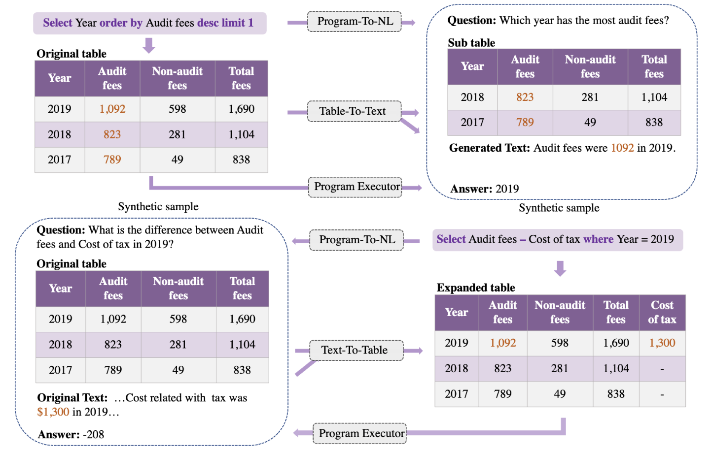

## 🏴󠁶󠁵󠁭󠁡󠁰󠁿 Overview

This is the repository for our paper *Toward a Unified Framework for Unsupervised Complex Tabular Reasoning*

## ⚡️ Quickstart

We experiment on three benchmarks: FEVEROUS, TAT-QA, and SEM-TAB-FACTS, and provide scripts for data generation and model training in the corresponding directory.

##  🏰 Synthetic Data
We release our synthetic data on four benchmark:[TAT-QA](https://drive.google.com/file/d/1mpcTMqgG_YdfYIxnOHfBUfawNhXuLWwC/view?usp=sharing),[WiKiSQL](https://drive.google.com/file/d/1RSkfy3pL97uOy_aA-_fNmZQtd8BYO-wN/view?usp=sharing),[SEM-TAB-FACTS](https://drive.google.com/file/d/1ZcF1NFlrKvXB_3NB1HBBIited81gGjOs/view?usp=sharing),[FEVEROUS](https://drive.google.com/file/d/1S4NHfeb2lw8jnDIfWDOFRk8heTPxdeiU/view?usp=sharing).

## 🤗 Docker
We also provide a docker environment. You can reproduce our results in it easily.
Coming soon!! (we will release it before 12, October)

## 📝 License

The code is open-sourced under [MIT License](LICENSE)

## ❓Any Question

Please create an issue or email us at: Zhenyu Li lizhenyucs@gmail.com
