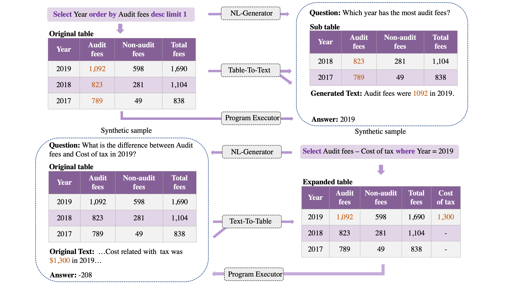

### 🏴󠁶󠁵󠁭󠁡󠁰󠁿 Overview

This is the repository for our paper *Toward a Unified Framework for Unsupervised Complex Tabular Reasoning*

### ⚡️ Quickstart

We experiment on three benchmarks: FEVEROUS, TAT-QA, and SEM-TAB-FACTS, and provide scripts for data generation and model training in the corresponding directory.